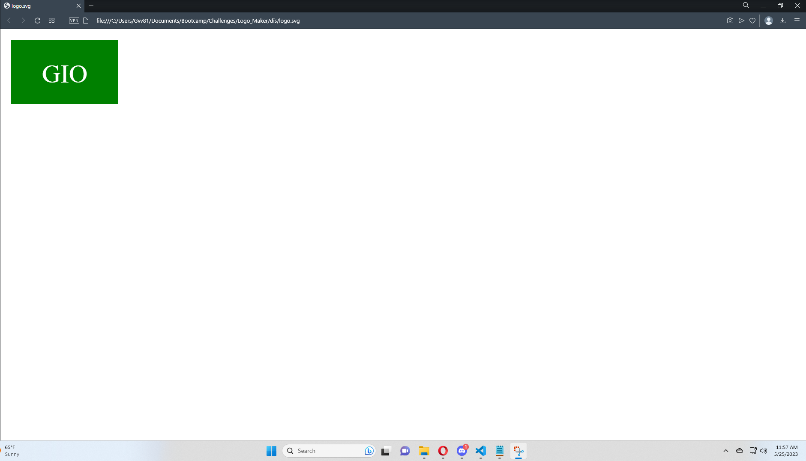

# Logo Maker

## Description

I wanted to make a tool to create a simple logo for any use. This creation of symbols lead me to looking at svg files. SVG is software used to make images in xml format. Things such as lines, shapes, and adding color to these images is possible with svg. With my small knowlage of svg and new learned concepts of classes in javascript brought about my new project Logo Maker. The goal of logo maker is to create a simple logo from a given list of shapes, a unique three letter message provided by users, and we let users enter in a desired color for their shape. Now to accomplish this we will be prompting users to get this data first and behind the scenes we will make the image for the user. I learned to make some simple shapes with svg and understand how the placement of the shape is determined in the program. Then I got more experiance with classes in javscript. I even got to use some inheritance in my project to clean up the classes we made for the project. I also continued to use nodejs for this project and used this new package called jest to run tests for my project. Another thing I got to learn was the concept of promise. I had to make sure promises were met or else my program would end or return nothing to users. All of this taught me to make Logos for users.

## Installation

Now to run this project you will need to install nodejs. I will include the link to get nodejs below. When downloading nodejs just make sure you get the proper version for your device.
 
Nodejs Installation Link: https://nodejs.org/en/download
 

After installing nodejs you will need to install the inquirer and jest for this project. I should have the correct packages already included in the package.json file, so all you need to do is enter in the following command in you terminal at the project folder location.
 
    npm install
 

If the previous command does not work you can use this other command to install inquirer.
 
    npm install inquirer@8.2.4
 

To install jest use this other command.
 
    npm install jest --save-dev

## Usage

The image above is the initiall prompt given when the project is ran. Users will be given three prompts to build a logo. There is data validation in the first prompt given. We make sure the user input is just three characters long. if no valid data is given the user will be prompted again with the same prompt until it is answered properly. The second prompt is just a list of different shapes avalible in this project. The last prompt given is asking for a color or hexdecimal format of a color to give users' shape a color. There is also data validation for the color prompt. We make sure the input enterd is either a word with no special characters or a hexidecimal number. For the hexidecimal number we are expecting a '#' character to let our program know its a hexadecimal. Then we make sure the rest of the characters are hexidecimal numbers. The image below shows how the prompt is given again with the previuos input entered

After the prompts we will build the logo and display either success or any errors in the terminal to confirm the status of users' logo. Assuming everything works fine you can go to the dis folder in this project to see your logo and examples of other logos made by this project. 

Example of logo created with data entered from the previous image above.

Here is a link to my video demo:

## Credits

Thank you to nodejs, inquirer, mdn web docs and jest
 
 - Nodejs provided the file system used to make the logo
 
 - Inquirer gave us the prompt functionality in the project
 
 - MDN web docs for providing me with knowledge on svg and how to build them.
Here is a link to the information learned:https://developer.mozilla.org/en-US/docs/Web/SVG/Tutorial/Introduction
 
 - Jest for giving me the power to make tests for my program

## License

The project is covered by the MIT license. Please refer to the repo for more information on the license. The link below we will link users to the template followed to make license.

License Link: https://spdx.org/licenses/MIT.html

## Badges

## Tests

I made some tests useing jest to make sure my program is working properly.
 

To run these tests use the following command: 
 
    npm run test 

## Questions

Any questions you may have you can contact me through my email shown below and there is a link to my github account.

Email: gvv8106@gmail.com

GitHub Profile: https://github.com/Giovanne-Villanueva
